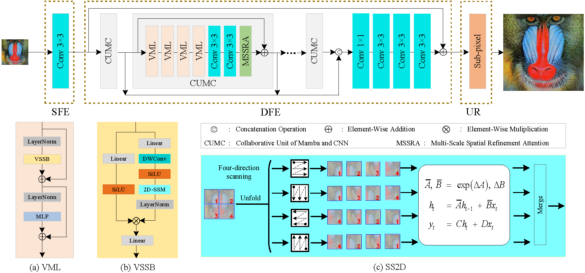

## A Collaborative Network of Mamba and CNN for Lightweight Image Super-Resolution
Our paper will be released soon.

<p align="center">
    
</p>

## Color-coded animations to visualize spatial disruption of Mamba (To vividly illustrate Fig.2 in the paper)

“`
[
“`


## <a name="Dependencies"></a>

Our code is runned on the Pytorch framework with the following environment configurations. 

- CUDA 11.7
- Python 3.9.19
- PyTorch 1.13.1 + cu117
- mamba_ssm 1.0.1

For the installation of Mamba with the selective scan, you may use the following command:

```
pip install causal_conv1d==1.0.0
pip install mamba_ssm==1.0.1
```


## Datasets

Following most previous lightweight SR methods, we employ [DIV2K](https://data.vision.ee.ethz.ch/cvl/DIV2K/) for training.
For testing, five benchmark datasets, including Set5, Set14, BSD100, Urban100, and Manga109 [[download link](https://drive.google.com/file/d/1n-7pmwjP0isZBK7w3tx2y8CTastlABx1/view?usp=sharing)], are used.

## Scripts
### Training
For example, after organizing the training dataset, you can use following command to train the model for ×2 SR.

```
python -m torch.distributed.launch --nproc_per_node=2 --master_port=12345 basicsr/train.py -opt options/train/train_JNMC_x2.yml --launcher pytorch
```

### Testing
Correspondingly, you may use the instruction below to test the model after training. 
```
python basicsr/test.py -opt options/test/test_JNMC_x2.yml
```

## <a name="cite"></a> Citation
Please cite us and star this repo, if our work is useful for your research. Thanks!

## <a name="cite"></a> Notes
Please note that there is a slight difference in the naming of the model between the code and the paper. Specifically, the model is referred to as 'Collaborative Network of Mamba and CNN (CNMC)' in the paper and 'Joint Network of Mamba and CNN (JNMC)' in the code. We apologize for any inconvenience this may have caused.

[//]: # (Similarly, the module 'Collaborative Unit of Mamba and CNN &#40;CUMC&#41;' in the paper is called 'Joint Unit of Mamba and CNN &#40;JNMC&#41;' in the code.)

## Acknowledgement
This code is based on [BasicSR](https://github.com/XPixelGroup/BasicSR), [ART](https://github.com/gladzhang/ART) , [VMamba](https://github.com/MzeroMiko/VMamba) and [MambaIR](https://github.com/csguoh/MambaIR). Thanks for their awesome works.
